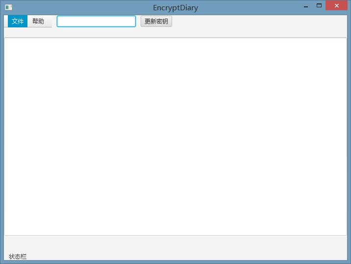

# EncryptDiary

使用128bit AES加密的日记软件，采用UTF-8编码。

## 为什么？

* 许多大型文档编写软件都是闭源的，而本软件的加密解密过程是透明的
* 将日记用电子形式保存比纸质形式更加便于存储于加密，也更加安全，不会受到物理上的限制
* **不以任何形式存储秘钥**，用户输入的秘钥仅在加密解密时使用
* 采用128位AES加密，针对AES的攻击是异常复杂的，使用现有技术不可能轻易做到，事实上要想完全破解AES，花费的时间要以数十亿年计

## 如何使用

1. 如果没有安装java环境需安装java环境
2. 下载EncryptDiary.jar release里下载最新版EncryptDiary.jar程序包
</img>
3. 双击运行EncryptDiary.jar
</img>
4. 在 更新秘钥按钮 左侧输入加密解密的秘钥，点击按钮后即可进行加密解密等基础操作

### 加密

1. 文本框内输入完毕后
</img>
2. 文件->创建日志文件 *.dir 即可
3. 或文件->保存修改的日志文件 可保存修改到一个已经存在的 *.dir 日志文件

### 解密

1. 文件->打开并译码

### 查看加密后的内容(密文)

1. 文件->打开 
</img>
